# Flask-Warehouse-challenge
 
 ## The Main Idea 
this is a small project for a warehouse which could have different branches and different product and we need to keep track of all the movement in/out to each place or branch 

 ## Technology used 
 - Flask -(python)
 - HTML , CSS , jinja Templates 
 - Javascript
 - Firebase - RealTime database 

## this is How the interface looks like 

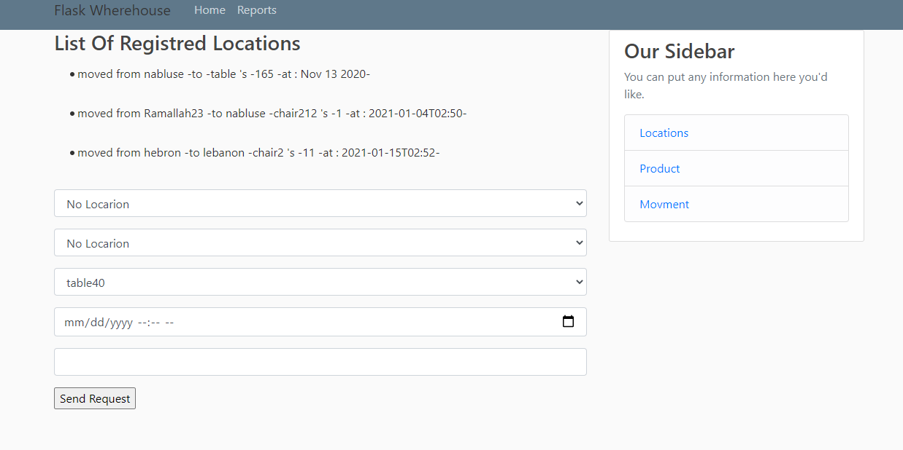
##  Movments
On this page, we can preview and add Movements from a location to another location as bellow 
first, you need to select the location from where, and to where, from a dropdown menu connected to the database 

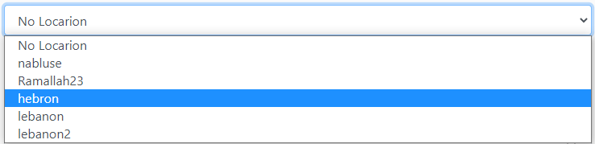

second, you need to specify the correct date for the movement

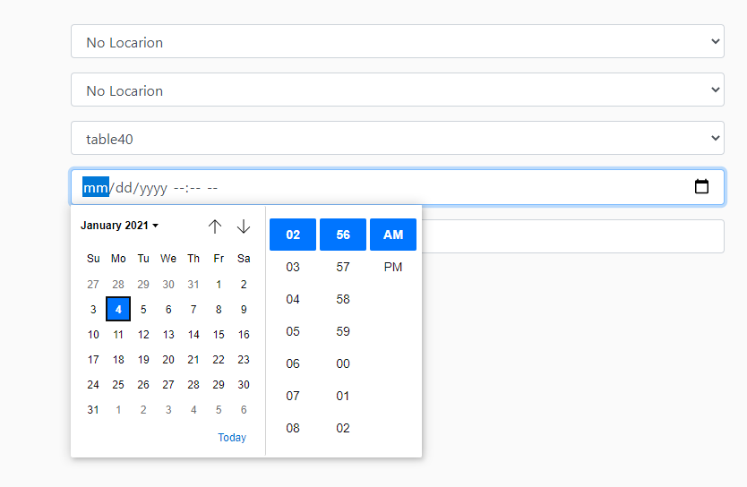

and also the quantity, any missing data will view an error and will not be added to the database as follows

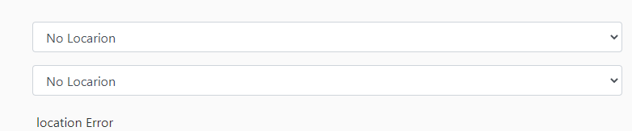
we Can't add a movement without at least having one known source from where, or to where, no date, or no quantity 
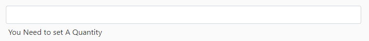
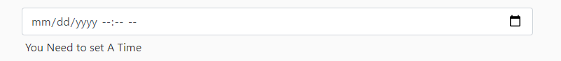
##  Products &&  Locations
in the Product Page, we will have a list of all product we have in the database, with and update button to each item and a form to add a new Product 
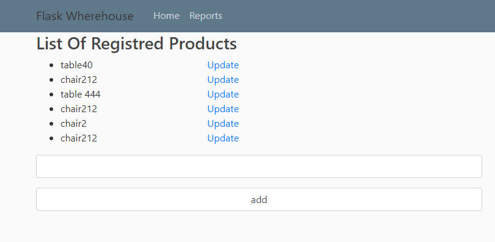
### adding a Product will update the list directly on the page : example
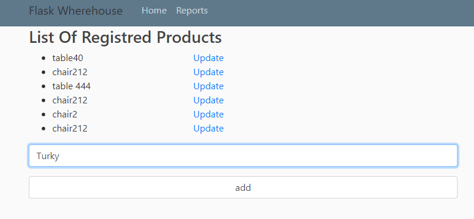
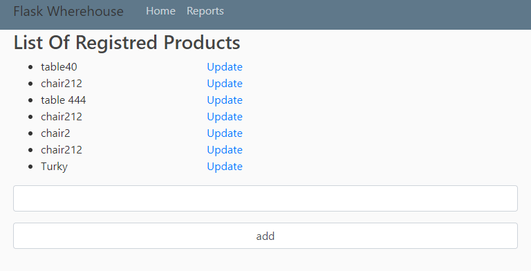

for the update, it will send you to the product page item update page and makes the update depending on the id of the document that holds the product name its a simple page with only a text field and a submit button

the same applay's to the location pages 
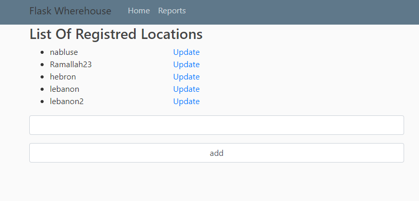
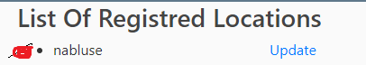
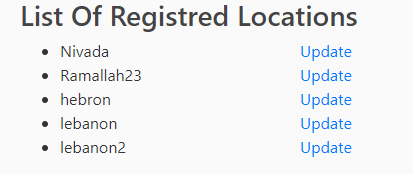

## Reports
now about the reports I just create a dynamic HTML page and convert it into a pdf with all needed information and view this pdf on the web as below
go to the nav and press on the report section 

the browser will send the file and view it like pdf as below
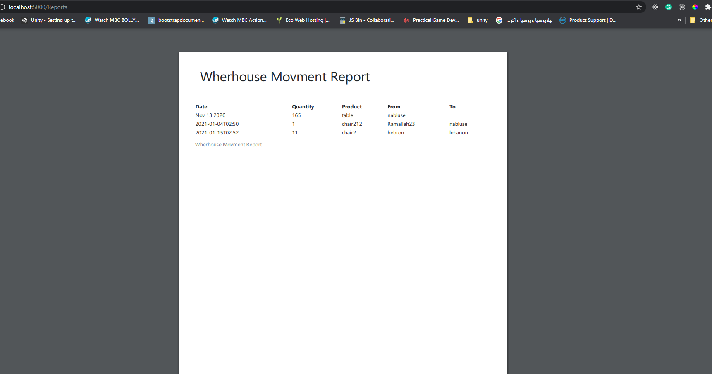

## How to run the app 

 ### this challenge is connected with the firebase-real-time Database so you need to connect to your credentials in the firebase realtime database 

- befor you start you need to install wkhtmltopdf from this link 
  https://github.com/wkhtmltopdf/wkhtmltopdf/releases/download/0.12.4/wkhtmltox-0.12.4_msvc2015-win64.exe

- install it in your machine and edit the path (Environment variables to get the bin folder )
  like this => "C:\Program Files\wkhtmltopdf\bin"

- update the env to  main.py 
  $env:FLASK_APP = "main.py"

- update the env to work with debug mode
  $env:FLASK_ENV = "development"

- run the program 
  flask run
